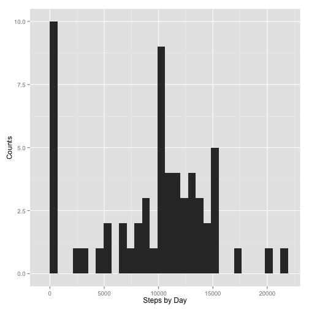
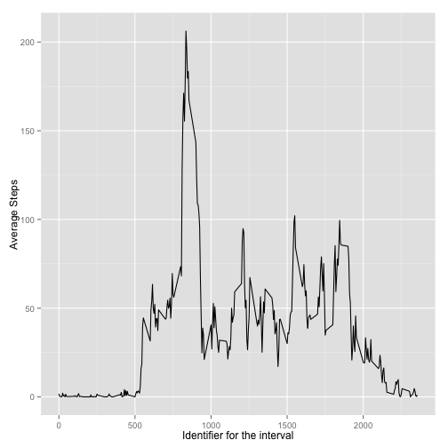
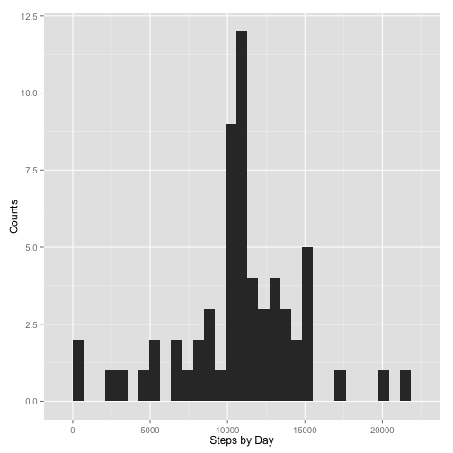
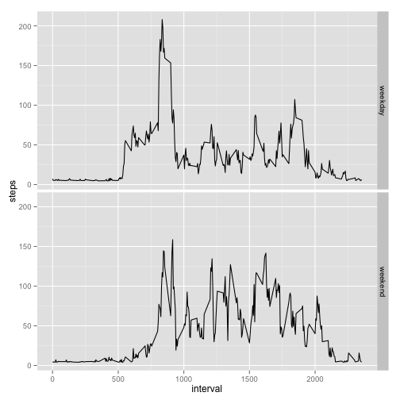

# Reproducible Research: Peer Assessment 1


## Loading and preprocessing the data

The data was load into R from "activity.csv".


```r
data <- read.csv("activity.csv", colClass=c("integer","Date","integer"), na.string="NA")
summary(data)
```

```
##      steps            date               interval   
##  Min.   :  0.0   Min.   :2012-10-01   Min.   :   0  
##  1st Qu.:  0.0   1st Qu.:2012-10-16   1st Qu.: 589  
##  Median :  0.0   Median :2012-10-31   Median :1178  
##  Mean   : 37.4   Mean   :2012-10-31   Mean   :1178  
##  3rd Qu.: 12.0   3rd Qu.:2012-11-15   3rd Qu.:1766  
##  Max.   :806.0   Max.   :2012-11-30   Max.   :2355  
##  NA's   :2304
```

## What is mean total number of steps taken per day?

1. Process the data by summing the number of steps by date. The NA values will not be included.


```r
steps_by_day <- tapply(data$steps, data$date, sum, na.rm=TRUE)
```

2. Make a histogram of the total number of steps taken each day.


```r
library('ggplot2')
qplot(steps_by_day, geom="bar", xlab='Steps by Day', ylab='Counts')
```

```
## stat_bin: binwidth defaulted to range/30. Use 'binwidth = x' to adjust this.
```

 

3. Calculate and report the mean and median total number of steps taken per day.


```r
mean_steps_per_day <- mean(steps_by_day)
median_steps_per_day <- median(steps_by_day)
```

The mean and median total number of steps taken per day are: 9354.2295 and 10395.

## What is the average daily activity pattern?

1. Prepare the data by averaging the steps at different time of day (i.e. "interval").


```r
intervals <- unique(data$interval)
avg_steps_by_interval <- tapply(data$steps, data$interval, mean, na.rm=TRUE)
```

2. Make a time series plot (i.e. type = "l") of the 5-minute interval (x-axis) and the average number of steps taken, averaged across all days (y-axis)


```r
qplot(intervals, avg_steps_by_interval, geom="line", xlab='Identifier for the interval', ylab='Average Steps')
```

 

3. Find which 5-minute interval, on average across all the days in the dataset, contains the maximum number of steps.

First, search which interval corresponds to the maximum number of steps.


```r
max_interval<-intervals[which(avg_steps_by_interval == max(avg_steps_by_interval))]
```

The result 835 corresponds to 8:35AM in the morning.

## Imputing missing values

Note that there are a number of days/intervals where there are missing values (coded as NA). The presence of missing days may introduce bias into some calculations or summaries of the data.

1. Calculate and report the total number of missing values in the dataset (i.e. the total number of rows with NAs)


```r
number_of_NA <- sum(is.na(data$steps))
```

The number of missing values is 2304.

2. Devise a strategy for filling in all of the missing values in the dataset. The strategy does not need to be sophisticated. For example, you could use the mean/median for that day, or the mean for that 5-minute interval, etc.

Create a new dataset that is equal to the original dataset but with the missing data filled in.

In the following analysis, all NA values have been replaced with the mean for that day. The function ave (group averages) was used to obtain daily average values for each entry.


```r
mean_steps_per_day <- mean(steps_by_day)
dates<-unique(data$date)
data$steps[is.na(data$steps)] <- ave(data$steps, dates, FUN = function(x) mean(x, na.rm = TRUE))[is.na(data$steps)]
number_of_NA <- sum(is.na(data$steps))
```

After replacement, the number of NA values is redued to 0.

3. Make a histogram of the total number of steps taken each day and Calculate and report the mean and median total number of steps taken per day. 


```r
steps_by_day_filled <- tapply(data$steps, data$date, sum, na.rm = TRUE)
qplot(steps_by_day_filled, geom="bar", xlab='Steps by Day', ylab='Counts')
```

```
## stat_bin: binwidth defaulted to range/30. Use 'binwidth = x' to adjust this.
```

 

```r
mean_steps_per_day_filled <- mean(steps_by_day_filled)
median_steps_per_day_filled <- median(steps_by_day_filled)
```

The mean and median values of total steps taken per day are: 1.0768 &times; 10<sup>4</sup> and 1.0765 &times; 10<sup>4</sup>. Compare with the original values (9354.2295 and 10395), these values do not differ significantly from the estimates from the first part of the assignment. Both the mean and median values changed slightly. So filling those values do not have a large impact of the results or the implications from the data.


## Are there differences in activity patterns between weekdays and weekends?

1. Create a new factor variable in the dataset with two levels – “weekday” and “weekend” indicating whether a given date is a weekday or weekend day.


```r
data$weekdays <- weekdays(data$date)
data$weekdays[data$weekdays=="Monday"]="weekday"
data$weekdays[data$weekdays=="Tuesday"]="weekday"
data$weekdays[data$weekdays=="Wednesday"]="weekday"
data$weekdays[data$weekdays=="Thursday"]="weekday"
data$weekdays[data$weekdays=="Friday"]="weekday"
data$weekdays[data$weekdays=="Saturday"]="weekend"
data$weekdays[data$weekdays=="Sunday"]="weekend"
data$weekdays <- as.factor(data$weekdays)
```

The levels in this factor variable "weekdays" are:

```r
levels(data$weekdays)
```

```
## [1] "weekday" "weekend"
```

2. Make a panel plot containing a time series plot (i.e. type = "l") of the 5-minute interval (x-axis) and the average number of steps taken, averaged across all weekday days or weekend days (y-axis).


```r
results <- tapply(data$steps, c(data$intervals,data$weekdays), mean, na.rm=TRUE)
results <- aggregate(steps ~ interval + weekdays, data=data, FUN=mean, na.action=na.omit)
ggplot(data=results, aes(x=interval, y=steps)) + geom_line() + facet_grid(weekdays ~ .)
```

 

The activity in weekdays is earlier than weekdays, and the peak number of steps in weekdays is larger than weekends.
